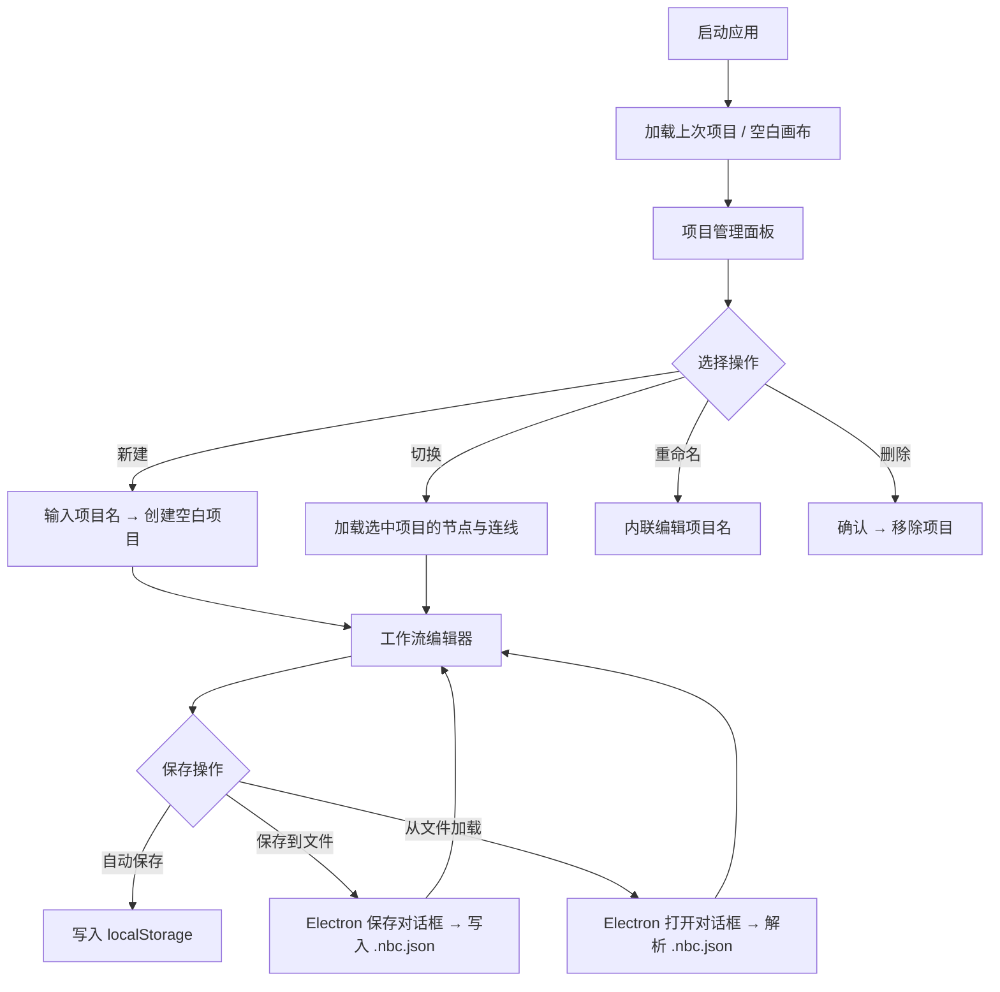

# NBC · 节点式素材创作器 — 产品需求文档

## 1. Product Overview

NBC 是一款基于 Electron + React 的桌面端节点式素材创作工具，面向内容创作者和设计师，通过可视化节点连线方式编排 AI 图像/视频生成工作流。当前版本的工作流数据仅存储在浏览器 localStorage 中，存在数据易丢失、无法跨设备迁移等问题。本次需求旨在引入**项目管理**与**本地文件持久化**能力，使用户可以安全地创建、切换、保存和分享工作流项目。

## 2. Core Features

### 2.1 User Roles

本产品为单用户桌面应用，无需角色区分。所有功能对本地使用者开放。

### 2.2 Feature Module

NBC 项目管理与本地持久化需求包含以下核心页面/模块：

1. **项目管理面板**：项目列表展示、创建新项目、切换当前项目、重命名项目、删除项目。
2. **工作流编辑器（改造）**：工具栏新增"保存到文件"与"从文件加载"按钮；状态栏显示当前项目名称与保存状态。
3. **文件导出/导入对话框**：通过 Electron 原生对话框选择保存路径或打开 `.nbc.json` 文件。

### 2.3 Page Details

| Page Name | Module Name | Feature description |
|-----------|-------------|---------------------|
| 项目管理面板 | 项目列表 | 展示所有已保存项目，显示项目名称、节点数量、创建时间、最后修改时间。支持点击切换当前活跃项目。 |
| 项目管理面板 | 新建项目 | 点击"新建项目"按钮，弹出命名输入框，创建空白项目并自动切换为当前项目。 |
| 项目管理面板 | 重命名项目 | 双击项目名称或点击重命名按钮，进入内联编辑模式，确认后更新项目名称。 |
| 项目管理面板 | 删除项目 | 点击删除按钮，二次确认后从本地存储中移除该项目数据。不允许删除当前活跃项目（需先切换）。 |
| 工作流编辑器 | 保存到文件 | 点击工具栏"保存到文件"按钮，调用 Electron 原生保存对话框，将当前工作流序列化为 `.nbc.json` 文件写入用户选择的路径。 |
| 工作流编辑器 | 从文件加载 | 点击工具栏"从文件加载"按钮，调用 Electron 原生打开对话框，选择 `.nbc.json` 文件，解析后加载到编辑器中。 |
| 工作流编辑器 | 自动保存 | 每次节点/连线变更后自动保存当前项目到 localStorage，防意外关闭丢失数据。 |
| 工作流编辑器 | 项目状态栏 | 编辑器顶部显示当前项目名称、未保存指示器（如有未持久化的变更）、上次保存时间。 |
| 文件格式 | `.nbc.json` 格式 | 文件包含 version、projectName、nodes、edges、metadata（createdAt、updatedAt、nodeCount、appVersion）字段。 |

## 3. Core Process

### 普通用户流程

1. 启动应用 → 加载上次活跃项目（或空白画布）。
2. 在项目管理面板中查看已有项目列表。
3. 点击某个项目 → 切换到该项目，编辑器加载对应节点和连线。
4. 在编辑器中拖拽节点、连线、配置参数。
5. 点击"保存到文件" → 系统弹出原生保存对话框 → 用户选择路径 → 写入 `.nbc.json` 文件。
6. 点击"从文件加载" → 系统弹出原生打开对话框 → 用户选择 `.nbc.json` 文件 → 解析并加载到编辑器。
7. 可随时新建项目、重命名、删除不需要的项目。

## 4. User Interface Design

### 4.1 Design Style

- **主色调**：深色主题，背景 `#1a1a2e`，面板 `#16213e`，强调色 `#6c5ce7`（紫色）
- **辅助色**：节点类型各有专属色（assetInput `#4ecdc4`、characterCard `#ff6b6b`、sceneCard `#f9ca24` 等）
- **按钮风格**：圆角小按钮（`rounded-md`），ghost/secondary/accent 三种变体
- **字体**：系统默认无衬线字体，正文 12-13px，标题 14px
- **布局**：三栏布局（左侧素材库 264px / 中间编辑器自适应 / 右侧属性面板 288px），底部面板 160px
- **图标**：使用 Lucide React 图标库，线条风格，14-16px

### 4.2 Page Design Overview

| Page Name | Module Name | UI Elements |
|-----------|-------------|-------------|
| 项目管理面板 | 项目列表 | 左侧面板内嵌或独立抽屉，列表项使用卡片样式，hover 高亮，当前项目左侧紫色边框指示。项目名 13px 加粗，元信息 10px 灰色。 |
| 项目管理面板 | 操作按钮 | 列表顶部"新建项目"按钮（accent 色），每项右侧显示重命名（铅笔图标）和删除（垃圾桶图标）ghost 按钮。 |
| 工作流编辑器 | 工具栏 | 顶部浮动工具栏，按钮组使用 secondary 样式，"全部运行"使用 accent 样式。新增"保存到文件"和"从文件加载"按钮，使用 Upload/Download 图标。 |
| 工作流编辑器 | 项目状态栏 | 工具栏右侧或编辑器顶部，显示项目名（12px 加粗）、保存状态圆点（绿色=已保存，橙色=未保存）、上次保存时间（10px 灰色）。 |
| 文件对话框 | 保存/打开 | 使用 Electron 原生系统对话框，无需自定义 UI。文件过滤器设置为 `.nbc.json` 和 `All Files`。 |

### 4.3 Responsiveness

本产品为 Electron 桌面应用，固定最小窗口尺寸 1000×600px。不涉及移动端适配，但需确保在不同分辨率显示器上三栏布局不溢出，面板宽度固定，中间编辑器区域自适应。

## 5. 可扩展模型/平台接入

NBC 需要支持多种 AI 模型提供商和第三方平台的灵活接入，通过插件化架构实现低成本扩展，避免硬编码单一服务商。

### 5.1 Provider 插件体系

采用统一的 Provider 接口规范，每个 AI 服务商（如 OpenAI、Stability AI、Midjourney、本地 ComfyUI 等）封装为独立插件模块。插件需声明自身支持的能力（文本生成、图像生成、视频生成等）、所需参数及默认配置。应用启动时自动扫描并注册可用 Provider，用户可在运行时动态启用/禁用。

### 5.2 自定义节点类型

在现有内置节点（素材输入、角色卡、场景卡等）基础上，允许用户基于已注册的 Provider 创建自定义节点。自定义节点需定义：节点名称、输入端口列表（含类型与默认值）、输出端口列表、关联的 Provider 及模型、默认参数模板。自定义节点保存在本地配置文件中，可随项目导出/导入。

### 5.3 API 配置管理面板

新增独立的「API 配置」设置页面，集中管理所有 Provider 的连接信息。面板功能包括：
- 列表展示所有已注册 Provider 及其连接状态（已连接/未配置/错误）。
- 每个 Provider 可展开编辑其 API Endpoint、API Key、默认模型、超时时间等参数。
- 提供「测试连接」按钮，验证配置有效性并返回延迟与可用模型列表。
- 配置数据加密存储于本地，API Key 不以明文形式暴露在 UI 中。

### 5.4 用户自定义 Endpoint/Key

支持用户为同一 Provider 配置多个 Endpoint（如官方 API、自建代理、本地部署地址）。用户可在节点级别选择使用哪个 Endpoint 配置，实现灵活的流量分配与环境切换（开发/生产）。Key 管理支持环境变量引用，避免硬编码。

### 5.5 兼容未来第三方平台

插件接口设计遵循开放协议，预留扩展点以兼容未来可能出现的第三方平台：
- Provider 接口使用 TypeScript 泛型定义，支持自定义请求/响应类型映射。
- 支持 Webhook 回调机制，适配异步生成类平台（如排队式视频生成服务）。
- 预留 OAuth2 授权流程接口，便于接入需要用户授权的平台（如 Midjourney Discord Bot 代理）。
- 插件可声明自定义 UI 组件，用于渲染平台特有的配置项或预览界面。
