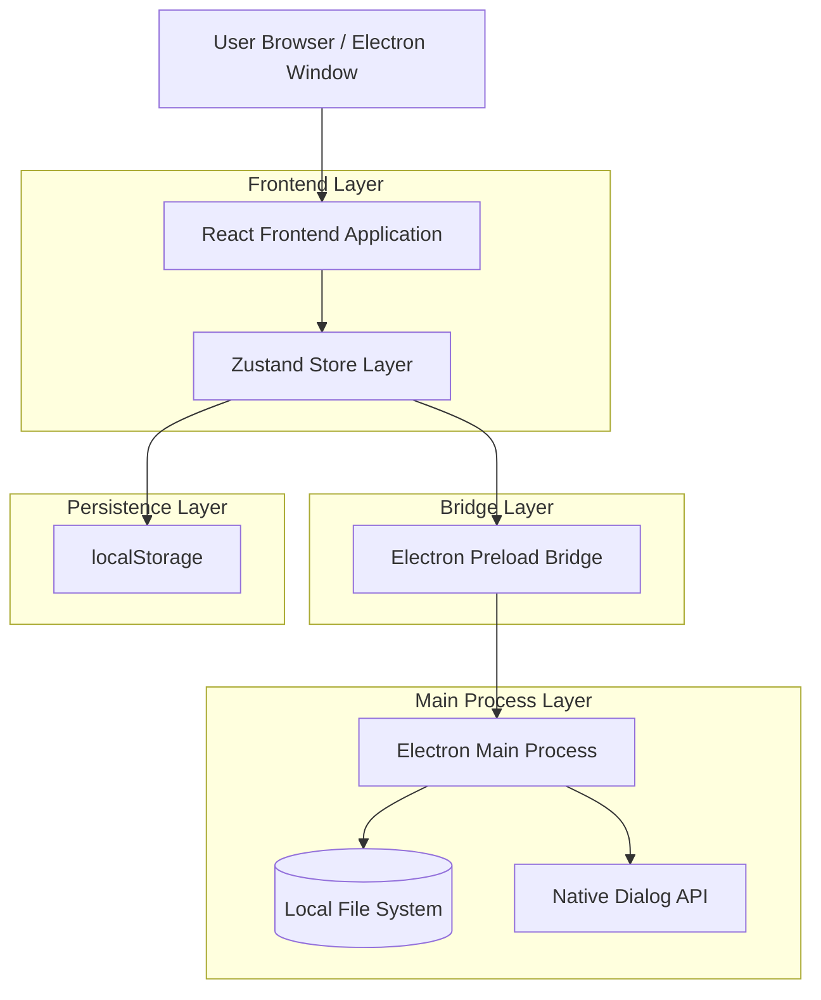
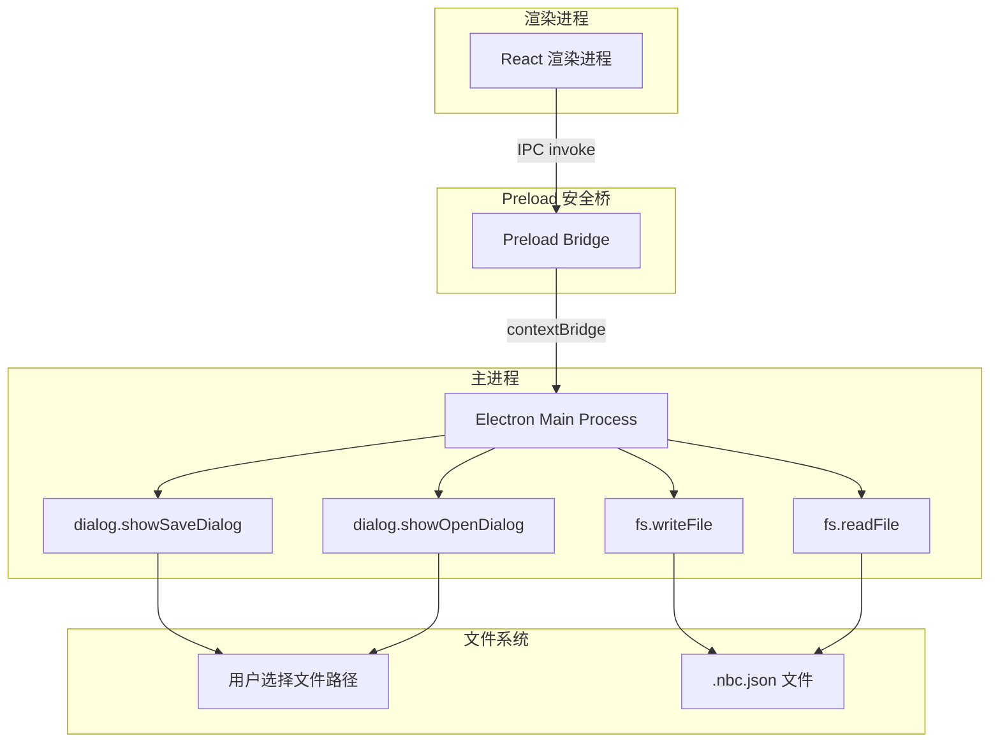
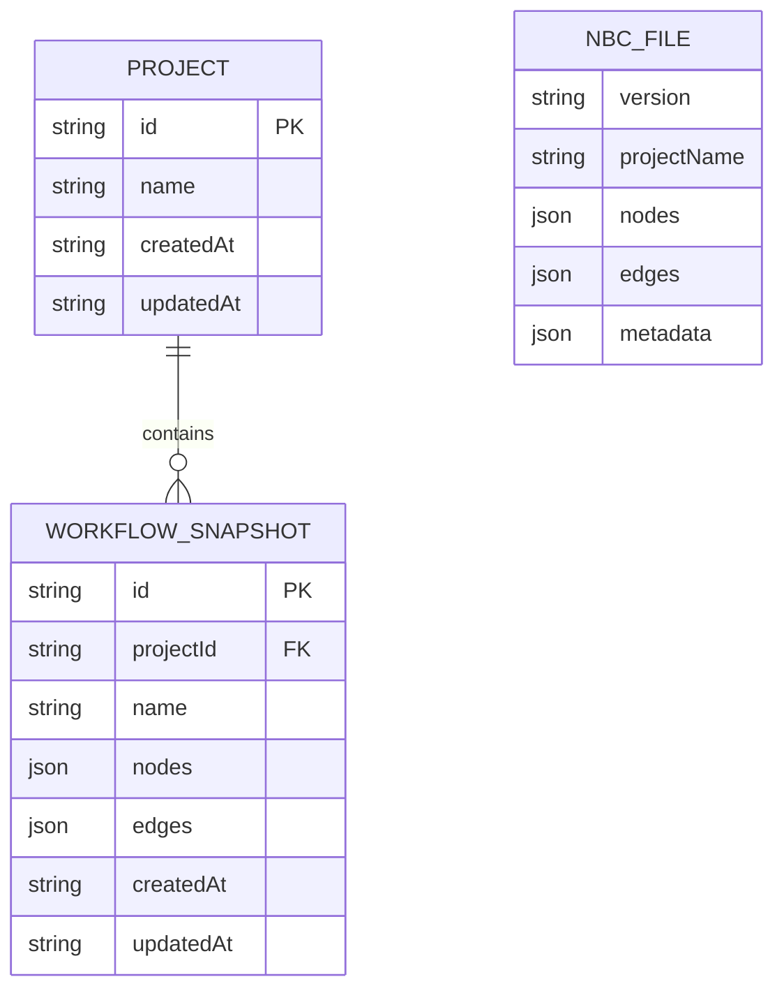

# NBC · 节点式素材创作器 — 技术架构文档

## 1. Architecture Design



## 2. Technology Description

- **Frontend**: React@18 + TypeScript@5 + Vite@5 + TailwindCSS@3 + ReactFlow@11 + Zustand@4
- **Desktop Shell**: Electron@29 + electron-builder
- **Persistence**: localStorage（项目列表与自动保存）+ 本地文件系统 `.nbc.json`（导出/导入）
- **Backend**: None（纯桌面端应用，无服务端）

## 3. Route Definitions

本产品为单页 Electron 应用，无前端路由。所有功能通过组件状态切换实现：

| 区域 | 组件 | Purpose |
|------|------|---------|
| 全局 | `MainLayout` | 三栏布局容器，管理面板开关状态 |
| 左侧 | `AssetBrowser` | 素材浏览器，扫描本地目录 |
| 中间 | `FlowEditor` | 节点编辑器，工作流画布 + 工具栏 |
| 右上 | `NodePalette` | 节点面板，拖拽添加节点 |
| 右下 | `Inspector` | 属性检查器，编辑选中节点参数 |
| 底部 | `GenerationQueue` / `FailureLogPanel` / `ChatPanel` | 生成队列、失败日志、AI 对话 |
| 弹窗 | `SettingsPanel` | API 配置面板 |

## 4. API Definitions

本产品无后端服务，所有 API 通过 Electron IPC 桥接实现。以下是与项目管理和文件持久化相关的 IPC 接口：

### 4.1 新增 IPC 接口

**保存工作流到文件**
```
project:saveToFile
```

| Param Name | Param Type | isRequired | Description |
|------------|------------|------------|-------------|
| workflowData | string | true | JSON.stringify 后的工作流数据 |
| defaultFilename | string | false | 默认文件名建议 |

Response:
| Param Name | Param Type | Description |
|------------|------------|-------------|
| filePath | string \| null | 用户选择的保存路径，取消则为 null |
| success | boolean | 写入是否成功 |

**从文件加载工作流**
```
project:loadFromFile
```

Response:
| Param Name | Param Type | Description |
|------------|------------|-------------|
| data | string \| null | 文件内容（JSON 字符串），取消或失败则为 null |
| filePath | string | 选中的文件路径 |

**重命名项目**
```
project:rename
```

| Param Name | Param Type | isRequired | Description |
|------------|------------|------------|-------------|
| projectId | string | true | 项目 ID |
| newName | string | true | 新项目名称 |

Response:
| Param Name | Param Type | Description |
|------------|------------|-------------|
| success | boolean | 是否成功 |

### 4.2 现有 IPC 接口（保留不变）

| IPC Channel | Purpose |
|-------------|---------|
| `dialog:openDirectory` | 打开目录选择对话框 |
| `fs:scanDirectory` | 扫描目录中的媒体文件 |
| `fs:readFile` | 读取文件并返回 base64 |
| `api:fetch` | 代理外部 API 请求 |
| `chat:send` | 发送聊天消息 |
| `save:local` | 保存生成结果到本地 |
| `save:oss` | 上传到 OSS |
| `save:feishu` | 飞书同步队列 |

## 5. Server Architecture Diagram

本产品无独立服务端。Electron 主进程承担文件系统操作职责：



## 6. Data Model

### 6.1 Data Model Definition



### 6.2 Data Definition Language

**localStorage 存储结构**

项目列表（`nbc_projects`）：
```json
[
  {
    "id": "1715001234567",
    "name": "角色立绘工作流",
    "createdAt": "2026-05-07T08:00:00.000Z",
    "updatedAt": "2026-05-07T10:30:00.000Z"
  }
]
```

项目数据（`nbc_project_{id}`）：
```json
{
  "nodes": [],
  "edges": []
}
```

当前活跃项目 ID（`nbc_active_project`）：
```
"1715001234567"
```

**`.nbc.json` 文件格式**

```json
{
  "version": "1.0.0",
  "projectName": "角色立绘工作流",
  "nodes": [
    {
      "id": "node_1_1715001234567",
      "type": "prompt",
      "position": { "x": 100, "y": 200 },
      "data": {
        "label": "提示词",
        "promptText": "a beautiful anime character..."
      }
    }
  ],
  "edges": [
    {
      "id": "edge_1",
      "source": "node_1_1715001234567",
      "target": "node_2_1715001234567",
      "sourceHandle": null,
      "targetHandle": null
    }
  ],
  "metadata": {
    "createdAt": "2026-05-07T08:00:00.000Z",
    "updatedAt": "2026-05-07T10:30:00.000Z",
    "nodeCount": 5,
    "appVersion": "1.0.0"
  }
}
```

**关键设计决策：**

1. **双层持久化**：localStorage 用于项目列表索引和自动保存（快速、零配置），`.nbc.json` 文件用于导出/导入（可迁移、可分享）。两者独立运作，文件导入时创建新项目。
2. **Electron 原生对话框**：使用 `dialog.showSaveDialog` / `dialog.showOpenDialog` 提供系统级文件选择体验，文件过滤器限定 `.nbc.json` 扩展名。
3. **Preload 安全桥**：所有文件操作通过 `contextBridge.exposeInMainWorld` 暴露，渲染进程无法直接访问 Node.js API，保持 `contextIsolation: true`。
4. **文件格式版本化**：`.nbc.json` 包含 `version` 字段，便于未来格式升级时做兼容处理。
5. **项目与工作流合并**：当前架构中"项目"即"工作流"，一个项目对应一份节点图。简化数据模型，避免多对多关系的复杂性。
